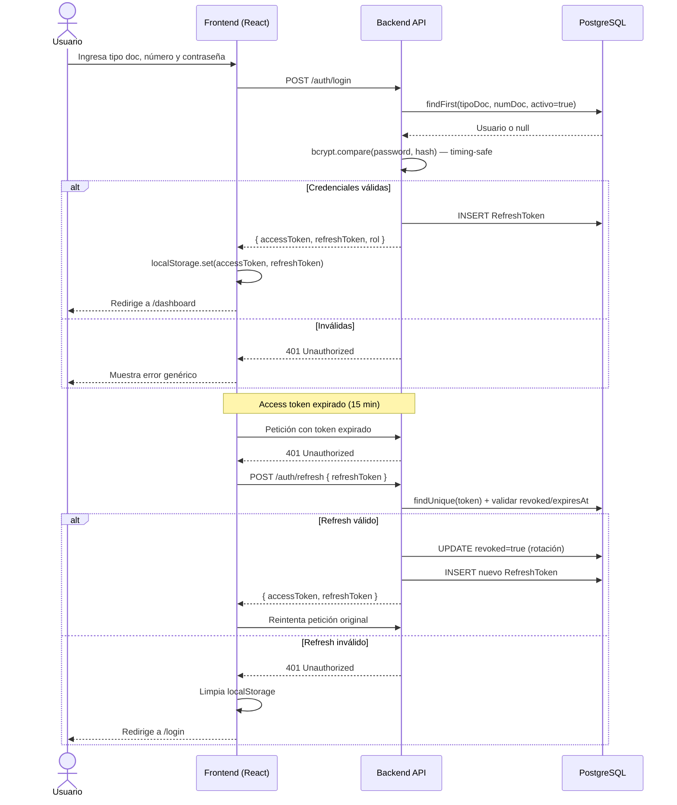
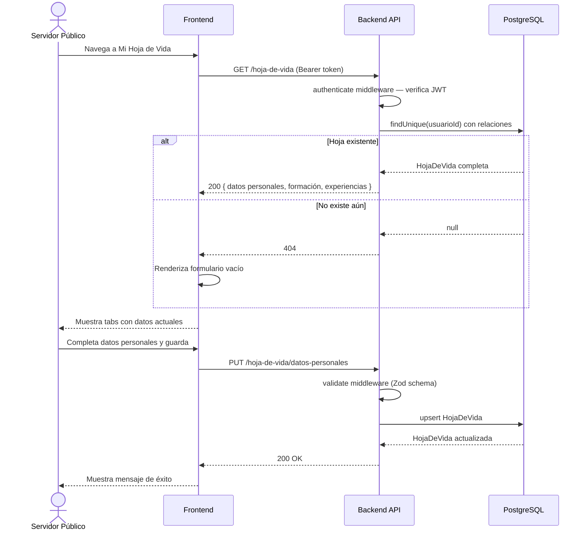
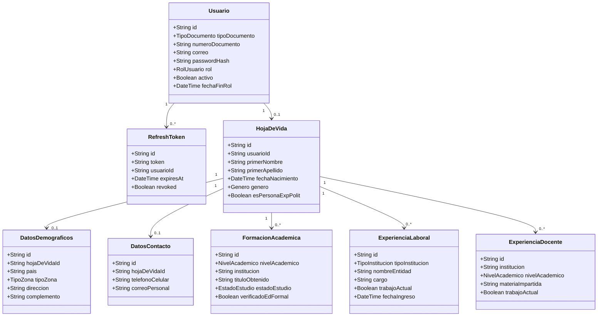
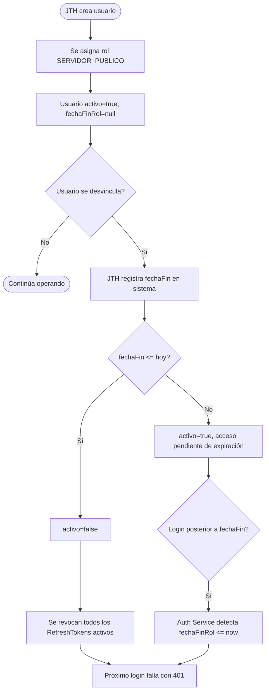

# Diagramas del Sistema SIGEP II

Diagramas como código (Diagrams as Code). Renderizables en cualquier visor de Mermaid o PlantUML.

---

## 1. C4 — Diagrama de Contexto

```plantuml
@startuml C4_Context
!include https://raw.githubusercontent.com/plantuml-stdlib/C4-PlantUML/master/C4_Context.puml

title Diagrama de Contexto — SIGEP II

Person(sp, "Servidor Público", "Empleado del Estado que gestiona su hoja de vida")
Person(jth, "Jefe de Talento Humano", "Administra usuarios y valida información")

System(sigep2, "SIGEP II", "Sistema de Gestión de Empleo Público")

System_Ext(smtp, "Servicio de Correo (SMTP)", "Envía notificaciones y contraseñas temporales")
System_Ext(funcpub, "Función Pública", "Entidad reguladora del empleo público en Colombia")

Rel(sp, sigep2, "Gestiona su hoja de vida", "HTTPS")
Rel(jth, sigep2, "Administra usuarios y accesos", "HTTPS")
Rel(sigep2, smtp, "Envía correos", "SMTP/TLS")
Rel(sigep2, funcpub, "Referencia normativa")

@enduml
```

---

## 2. C4 — Diagrama de Contenedores

```plantuml
@startuml C4_Containers
!include https://raw.githubusercontent.com/plantuml-stdlib/C4-PlantUML/master/C4_Container.puml

title Diagrama de Contenedores — SIGEP II

Person(sp, "Servidor Público / JTH")

System_Boundary(sigep2, "SIGEP II") {
  Container(frontend, "Frontend SPA", "React + Vite + TypeScript", "Interfaz de usuario responsiva")
  Container(backend, "Backend API", "Node.js + Express + TypeScript", "API REST con autenticación JWT")
  ContainerDb(db, "Base de Datos", "PostgreSQL 16", "Usuarios, hoja de vida, tokens")
}

System_Ext(smtp, "SMTP")

Rel(sp, frontend, "Accede vía navegador", "HTTPS")
Rel(frontend, backend, "Llamadas REST", "HTTPS + JWT Bearer")
Rel(backend, db, "Consultas ORM", "TCP / Prisma")
Rel(backend, smtp, "Envía correos", "SMTP/TLS")

@enduml
```

---

## 3. C4 — Diagrama de Componentes (Backend)

```plantuml
@startuml C4_Components_Backend
!include https://raw.githubusercontent.com/plantuml-stdlib/C4-PlantUML/master/C4_Component.puml

title Componentes del Backend — SIGEP II

Container_Boundary(api, "Backend API") {
  Component(authRouter, "Auth Router", "Express Router", "POST /login, /refresh, /logout, /recuperar-password, PATCH /cambiar-password")
  Component(hvRouter, "HojaDeVida Router", "Express Router", "CRUD hoja de vida por sección")
  Component(usuRouter, "Usuario Router", "Express Router", "Gestión de usuarios (JTH)")

  Component(authCtrl, "Auth Controller", "TypeScript", "Orquesta flujos de autenticación")
  Component(hvCtrl, "HojaDeVida Controller", "TypeScript", "Orquesta CRUD de hoja de vida")
  Component(usuCtrl, "Usuario Controller", "TypeScript", "Orquesta administración de usuarios")

  Component(authSvc, "Auth Service", "TypeScript", "Login, JWT, bcrypt, refresh tokens, PAM")
  Component(hvSvc, "HojaDeVida Service", "TypeScript", "Lógica de negocio de hoja de vida")
  Component(usuSvc, "Usuario Service", "TypeScript", "Creación e inhabilitación de usuarios")

  Component(authMw, "Authenticate Middleware", "TypeScript", "Verifica JWT, extrae payload")
  Component(validateMw, "Validate Middleware", "TypeScript", "Validación Zod de request body")
  Component(rateMw, "RateLimit Middleware", "express-rate-limit", "Previene brute-force")

  Component(prisma, "Prisma Client", "ORM", "Queries parametrizadas anti SQL injection")
}

ContainerDb(db, "PostgreSQL")

Rel(authRouter, authCtrl, "delega")
Rel(hvRouter, hvCtrl, "delega")
Rel(usuRouter, usuCtrl, "delega")
Rel(authCtrl, authSvc, "usa")
Rel(hvCtrl, hvSvc, "usa")
Rel(usuCtrl, usuSvc, "usa")
Rel(authSvc, prisma, "consulta")
Rel(hvSvc, prisma, "consulta")
Rel(usuSvc, prisma, "consulta")
Rel(prisma, db, "SQL parametrizado", "TCP")

@enduml
```

---

## 4. Diagrama de Secuencia — Login y Refresh Token (Mermaid)



---

## 5. Diagrama de Secuencia — Gestión de Hoja de Vida (Mermaid)



---

## 6. Diagrama de Clases — Modelo de Dominio (Mermaid)



---

## 7. Diagrama de Flujo PAM — Gestión de Accesos Privilegiados (Mermaid)


